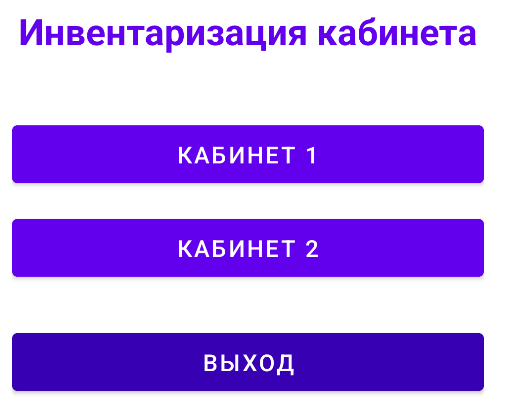
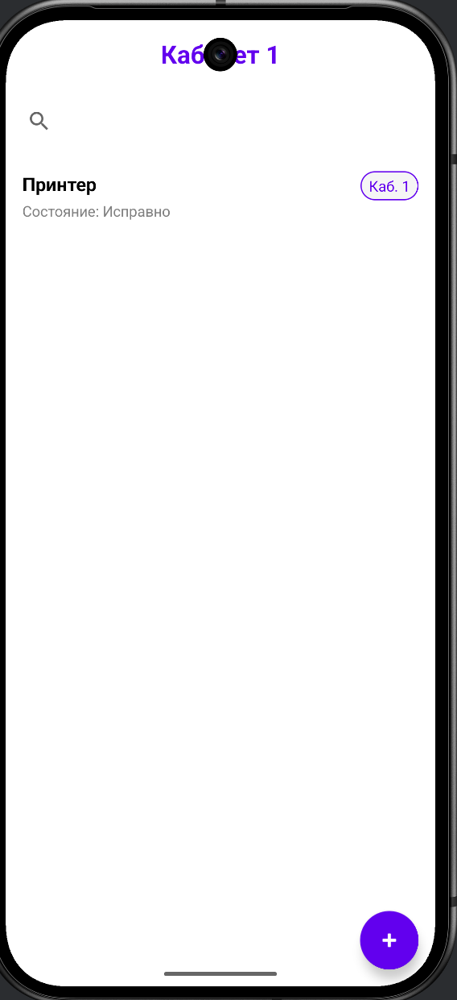
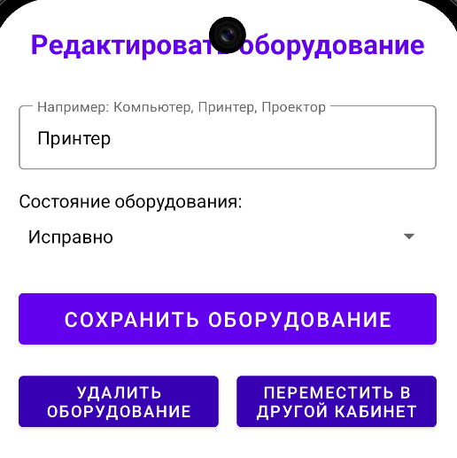
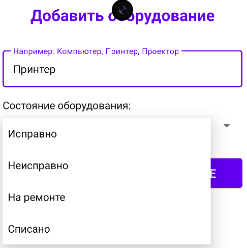
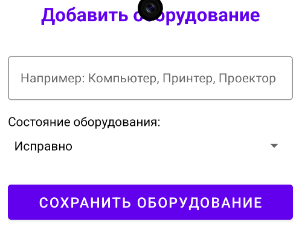

·Главное меню: вход в аккаунт или регистрация нового пользователя.

·Второй экран: выбор кабинетов и кнопка выхода из аккаунта.

·Кабинет 1: список дабавленного оборудования; при выборе оборудования возможность редактировать его состояние, перместить в другой кабинет и удаление даннаго оборудования;кнопка добавления оборудования. 

·Поле для наименования оборудования и выбор его состояния;   кнопка сохранения оборудования. 

·Кабинет 2: список дабавленного оборудования; при выборе оборудования возможность редактировать его состояние, перместить в другой кабинет и удаление даннаго оборудования;кнопка добавления оборудования. 

·Поле для наименования оборудования и выбор его состояния; кнопка сохранения оборудования. 
